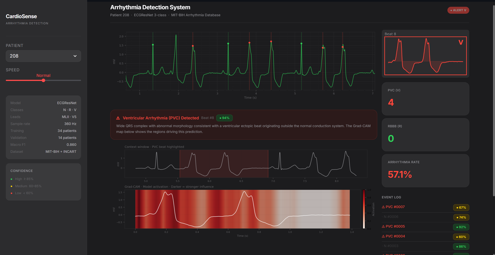

# ECG-Arrhythmia-Classifier

> **PyTorch · CNN 1D · MIT-BIH + INCART · GradCAM · Dashboard**  
> End-to-end arrhythmia classification pipeline: data preprocessing, model training, interpretability analysis, and interactive diagnostic dashboard.

---

## Dashboard



Interactive real-time visualization built with Streamlit. Processes each beat sequentially, shows GradCAM activation maps for detected arrhythmias, and logs confidence per beat.

```bash
streamlit run dashboard.py
```

---

## What this project does

Trains a lightweight ResNet-style CNN to classify ECG heartbeats into 3 clinically relevant categories, using two independent public databases to improve generalization:

| Class | Description | Test samples |
|-------|-------------|-------------|
| **N** | Normal sinus rhythm | 48,759 (83.3%) |
| **R** | Right Bundle Branch Block (RBBB) | 1,345 (2.3%) |
| **V** | Premature Ventricular Contraction (PVC) | 8,427 (14.4%) |

The project covers the full ML pipeline: preprocessing, patient-independent splitting, training, GradCAM interpretability, rigorous evaluation, and an interactive dashboard for visual diagnosis.

---

## Results

| Metric | Value |
|--------|-------|
| Accuracy | **92.64%** |
| Macro F1 | **0.8602** |
| Macro AUC | **0.9769** |
| Parameters | 184,003 |

**Per-class breakdown:**

| Class | Precision | Recall | F1 | AUC |
|-------|-----------|--------|----|-----|
| N | 0.9726 | 0.9396 | 0.9558 | 0.9651 |
| R | 0.7567 | 0.9413 | 0.8390 | 0.9956 |
| V | 0.7324 | 0.8476 | 0.7858 | 0.9698 |

The Macro AUC of **0.9769** reflects strong class separation even under heavy class imbalance (83% N). Class R reaches near-perfect AUC (0.9956). The gap between AUC and Macro F1 is expected — AUC measures ranking ability while F1 is threshold-sensitive.

---

## Datasets

Two independent public ECG databases were used to improve model generalization:

- **MIT-BIH Arrhythmia Database** — 48 half-hour 2-lead ambulatory ECG recordings. The most widely used benchmark for arrhythmia classification. Available at [PhysioNet](https://physionet.org/content/mitdb/).
- **INCART Database** — 75 half-hour 12-lead ECG recordings from the St. Petersburg Institute of Cardiological Technics. Provides additional patient diversity and signal variability. Available at [PhysioNet](https://physionet.org/content/incartdb/).

Both datasets were preprocessed with a patient-independent split to prevent data leakage between training and test sets.

---

## Architecture

Lightweight 1D ResNet designed for efficiency:

```
Input (1D ECG window)
  └─ Conv1D stem
  └─ ResBlock × 3  (residual connections, BatchNorm, ReLU)
  └─ Global Average Pooling
  └─ FC → 3 classes (softmax)
```

- **184K parameters** — lightweight by design, oriented toward future edge deployment
- Trained with Focal Loss to handle class imbalance (N dominates 83%)
- GradCAM applied post-training to visualize which ECG regions drive each prediction

---

## Repo structure

```
ECG-Arrhythmia-Classifier/
├── 01_data_exploration.ipynb       # Data loading and exploration
├── 02_data_preprocessing.ipynb     # Patient-independent train/test split
├── 03_model_training.ipynb         # Model definition and training loop
├── 04_gradcam.ipynb                # GradCAM interpretability analysis
├── 05_evaluation.ipynb             # Full evaluation: ROC, confusion matrix,
│                                   # confidence analysis, threshold tuning
├── dashboard.py                    # Interactive diagnostic dashboard
├── ecg_resnet_best.pth             # Best model checkpoint (Macro F1 = 0.860)
├── dashboard_image.png
├── confidence_distribution.png
├── confusion_matrix_eval.png
├── confusion_matrix_final.png
├── roc_curves.png
├── summary_scores.png
├── threshold_tuning.png
└── training_history_final.png
```

---

## Quickstart

### Requirements

```bash
pip install torch numpy scikit-learn matplotlib seaborn streamlit wfdb scipy
```

Trained on: **NVIDIA RTX 5070** · CUDA 12.x · Python 3.11

### Run evaluation

```bash
git clone https://github.com/pablopedreroo/ECG-Arrhythmia-Classifier
cd ECG-Arrhythmia-Classifier
jupyter notebook 05_evaluation.ipynb
```

### Run dashboard

```bash
streamlit run dashboard.py
```

---

## Key outputs

| File | Description |
|------|-------------|
| `roc_curves.png` | One-vs-Rest ROC with AUC per class |
| `confusion_matrix_eval.png` | Raw counts + recall-normalized |
| `confidence_distribution.png` | Model confidence: correct vs incorrect |
| `summary_scores.png` | F1 and AUC per class |
| `threshold_tuning.png` | Baseline vs threshold-optimized F1 |
| `training_history_final.png` | Loss and F1 curves across epochs |

---

## Why this project matters

Arrhythmia classification from raw ECG has direct clinical impact — early detection of PVC and RBBB can prevent serious cardiac events. This project implements a rigorous end-to-end pipeline:

1. Multi-database preprocessing with patient-independent splits
2. CNN training with class imbalance handling
3. GradCAM interpretability — understanding *what* the model learns
4. Full diagnostic evaluation: ROC curves, confusion matrix, confidence analysis, threshold tuning
5. Interactive dashboard for visual exploration of predictions

---

## References

- Moody GB, Mark RG. *The impact of the MIT-BIH Arrhythmia Database.* IEEE Eng in Med and Biol 20(3):45-50 (2001)
- Taddei A, et al. *The European ST-T database.* (INCART database, PhysioNet)
- PhysioNet MIT-BIH: https://physionet.org/content/mitdb/
- PhysioNet INCART: https://physionet.org/content/incartdb/

---

## Author

**Pablo Pedrero**  
NVIDIA Deep Learning Institute certified · PyTorch · Medical signal processing  
[LinkedIn](https://www.linkedin.com/in/pablo-pedrero-garcia-36022a388/) · [GitHub](https://github.com/pablopedreroo)
